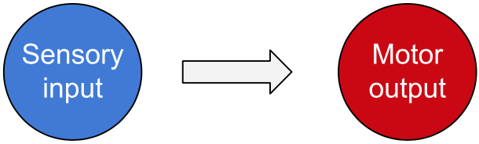
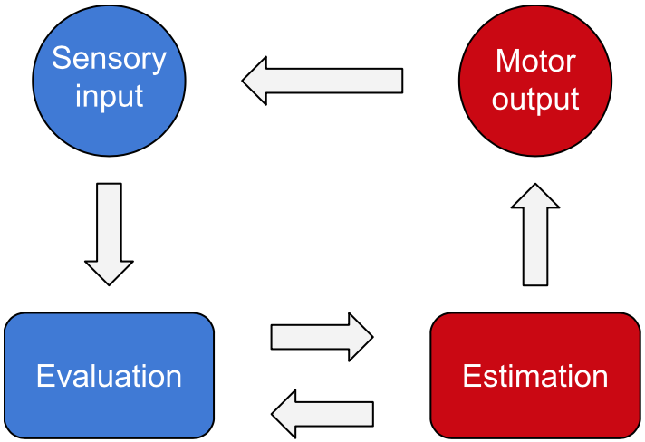

## Chapter 3: Consciousness

#### Input and output

Consciousness is the translation of the data registered by our senses, which we can call sensory input, into coordinated muscle contractions, which we can call motor output.

#### Evaluation and estimation

Some sensory input constitutes relevant information in its raw form, while other input has to be constructed into objects or situations to warrant a response.
Some information comes predefined as good or bad, while some of it becomes good or bad by association.
We evaluate our current state by adding the goodness and subtracting the badness of everything we perceive.
We then estimate, based on previous experience, how we could manipulate our environment to improve our state.
We continue to evaluate each estimation and choose the response estimated to produce the biggest improvement.
When we act, we receive new sensory input, which serves as feedback on the choice we made.

#### The neuron

We can improve our thinking of thinking by thinking about the actual neurons in the brain that accomplish it. A neuron is a cell consisting of a cell body that receives electrical signals from other neurons and an axon through which it sends them. A neuron only sends its signal once the sum of the signals it receives exceeds a certain threshold value, at which point we say it has become activated. An activated neuron contributes to the activation of other neurons, which in turn contribute to the activation of other ones. Every time a neuron is activated, it has a refractory period before it can become activated again, which defines its maximum frequency of activation. How much a neuron’s frequency of activation is affected by the different neurons it receives signals from is proportional to how frequently they send them and how strongly it is connected to them.
The nervous system
In our eyes, ears, skins, noses, and mouths, we have specialized sensory neurons activated by light, pressure, temperature, or the presence of specific molecules. When activated, these neurons send their signals through our spinal cords or cranial nerves to neurons in the temporal, occipital, and parietal lobes of our brains, which assemble the sensory input into objects located in space and time. In our frontal lobes, the objects are assembled into situations, such as the motion of an object at a certain speed in a certain direction. From each situation, the frontal lobes deduce a goal, such as catching an approaching ball, which they then formulate a response to attain. The instructions are received by our motor neurons, which project their axons through the spinal cord to muscle fibers in the body or through cranial nerves to muscle fibers in the face. When activated, the muscle fibers contract, making us move to accomplish the set goal.

How the neurons may be organized
We can explain many of the nervous system’s functions by postulating that the neurons are organized into layers, where each neuron in a higher layer is connected to a specific combination of neurons in the layer below it and all adjacent layers relate to each other in the same way. Further, the nervous system could be divided into a sensory stack, which constructs stimuli by transmitting signals from lower layers to higher ones, and a motor stack, which constructs responses by transmitting signals in the opposite direction, from higher layers that outline the response to lower ones that fill in the details with increasing precision. The sensory stack and the motor stack may in turn be divided into sub-stacks, which would allow information from the different senses to be processed in parallel and different muscle groups to be activated independently. For simplicity, we can call all the neurons in the sensory stack sensory neurons and all the neurons in the motor stack motor neurons from now on.

How the information may be processed
Let us examine what each layer would do as we respond to a stimulus, taking the act of seeing and grabbing a cup of coffee as our example. When light reflected off the steaming cup reaches our eyes, first-layer sensory neurons in the retina register individual dots of light without considering how these dots are related to each other. They pass their information on to second-layer sensory neurons in the area of the brain that processes visual data, which take the dots and string them together into lines. Third-layer sensory neurons then use these lines to build shapes, which fourth-layer sensory neurons use to build objects and determine their location. Fifth-layer sensory neurons, which receive information about multiple objects, represent relations between different objects at different locations or between the same object at different locations at different points in time. It is a fourth-layer sensory neuron that identifies the cup of coffee and a fifth-layer sensory neuron that realizes we are in a position to grab it and go for a sip. A fifth-layer motor neuron then begins to coordinate the grab and the sip. A fourth-layer motor neuron coordinates the reaching movement of the arm with the grabbing movement of the hand. Third-layer motor neurons coordinate the flexion of the different joints within the arm and the hand. Second-layer motor neurons coordinate the activation of the different muscle fibers to flex each joint the appropriate amount and first-layer motor neurons activate the muscle fibers to make the movements happen (Wikipedia: Model of hierarchical complexity).
From stimulus to response
Based on our coffee-sipping example, we might conclude that the connections between the sensory stack and the motor stack must be between the sensory neurons that gather the whole picture of each situation and the motor neurons that initiate the responses to them. Already when light hits the retina, however, we can squint and constrict our pupils if the light is too bright, and we can have an emotional response to an object even before we have put it into context. Going even further, us sitting there with our cups might not even be the whole picture of the situation because what about the other people sitting around the table with their cups and what they are thinking about us when we are thinking about taking a sip? We must accept that there might not be anything such as a whole picture. Instead, we can think of all sensory neurons as representing stimuli belonging to different layers and conclude that we can respond to the stimuli of any layer. Finally, since every stimulus is composed of stimuli belonging to the layer below it, the response to any stimulus should coordinate responses aimed at that stimulus' components. Every sensory neuron must thus be connected to a motor neuron in the same layer.

The picture below aims to illustrate all we just went through. Some of the details, however, have not yet been explained. Why are some of the sensory neurons colored pink? What are the arrows connecting neurons within the same layer? And why are there, in addition to the arrows from the sensory stack to the motor stack, arrows going back to the sensory stack?

Operant conditioning
The pink neurons, which we will call reinforcement neurons, represent stimuli that have been predefined as desirable. When a reinforcement neuron is activated, it reinforces the connections between the sensory neurons in its own layer that have recently been activated and the sensory neurons in the previous layer that activated them, which we can refer to as their components. This process, called operant conditioning, makes the sensory neurons more easily activated by the components that preceded the desirable stimulus. A sensory neuron getting the connections to its components reinforced could be seen as reinforcing the stimulus it represents, making it more easily recognizable. The reinforcement neurons themselves should have a fixed set of components.

By which percentage each connection between a sensory neuron and its components is reinforced can be hypothesized to be proportional to the frequency of activation of the sensory neuron, the frequency of activation of the component, and the frequency of activation of the reinforcement neuron. For this hypothesis to be valid, a neuron must remain active for some time after the stimulus that led to its activation has passed. Its remaining frequency of activation should be inversely proportional to the time that has elapsed since it became activated so that more recent stimuli become more strongly associated with current stimuli.
Classical conditioning
The connections between neurons in the same layer perform different functions in the sensory stack and the motor stack. In the sensory stack, they cause sensory neurons to become activated by other sensory neurons in the same layer whose activations have previously preceded theirs. Every time a sensory neuron is activated, it reinforces the intra-layer connections through which it is currently receiving signals. This mechanism of reinforcement, called classical conditioning, does not depend on reinforcement neurons.

By which percentage each connection between sensory neurons in the same layer is reinforced can be hypothesized to be proportional to the activated neuron’s own frequency of activation and the remaining frequency of activation of each neuron it receives signals from. Connections reinforced through operant and classical conditioning alike should spontaneously weaken over time to make us forget associations that were made by coincidence
Stimulus sequences
Classical conditioning causes repeated exposure to a stimulus to generate expectations based on what stimuli have followed it in the past. How strongly a sensory neuron representing an expected stimulus becomes activated should be proportional to how probable that stimulus is to follow the first stimulus and inversely proportional to the average time separating the two stimuli. If a sensory neuron develops an intra-layer connection to a reinforcement neuron, it will activate that reinforcement neuron to some degree every time it becomes activated itself. This effectively allows it to borrow the reinforcement neuron’s function to reinforce stimuli that have been activated recently before its own activation. This results in sequences of stimuli in each layer, each of which leads up to the activation of a reinforcement neuron.

Goals
Before we get to the intra-layer connections in the motor stack, we must understand those between the sensory stack and the motor stack. It would make sense for each stimulus to elicit a response that has been tailored to that particular stimulus, like how cold makes us shiver, heat makes us sweat, and an approaching punch to the face makes us flinch. Higher-layer stimuli, however, contain too many details to be responded to in a uniform manner every time.

One way our responses could be calibrated would be if sensory neurons above the object layer were to represent goals that their responses aim to attain. An activated motor neuron could then coordinate the activation of its components to maximize the activation of the sensory neuron that activated it. To understand why this would be useful we have to recall that any stimulus is a step on the path toward activating a reinforcement neuron. By achieving one goal at a time, we eventually achieve our end goal represented by the reinforcement neuron.

In contrast to how sensory neurons activate motor neurons directly through neural connections, motor neurons affect the sensory neurons they are connected to indirectly by affecting the environment, which supplies the sensory input. The arrows from the motor stack to the sensory stack do thus not represent neural connections but merely demonstrate the causal relationship.
Opportunity and need
The essential components of a goal are having the opportunity to achieve it and not yet having achieved it. When an opportunity to achieve a goal presents itself, the sensory neuron representing the goal activates its motor neuron, making us pursue it. When we pursue a goal successfully, we gradually increase our opportunity to achieve it, which increases the activation of the sensory neuron representing the goal. When the goal is achieved, the need to achieve it disappears, which deactivates the sensory neuron. Achieving one goal in a sequence increases the opportunity to achieve the next, making us move on to pursue that goal. The same process continues until the reinforcement neuron has become maximally activated, at which point it becomes deactivated for some period, leaving us to pursue other sources of fulfillment.

Choice
Motor neurons in the same layer and sub-stack compete for components and hence cannot be activated simultaneously. When multiple sensory neurons in the same layer attempt to activate their motor neurons at the same time, we can postulate that the motor neuron receiving the strongest signal from its sensory neuron should become activated first. This could be accomplished by the motor neurons sending deactivating signals to each other until only the one with the strongest activation remains active, a mechanism called lateral inhibition. The arrows between motor neurons in the same layer thus represent deactivating connections, as opposed to the activating ones we find in the sensory stack. The goal whose response is chosen is the focus of our attention, the thing we act on or plan to act on.

Coordination
How then is the chosen response executed? When a motor neuron is activated, it signals to its components in the underlying layer, which get activated in proportion to the strength of their connections to the coordinating motor neuron. These then have to compete to stay active, both with each other and with motor neurons in the same layer that are not part of the coordinated response. The winner will be the motor neuron receiving the biggest sum of activating signals, adding that from its sensory neuron to that from the coordinating motor neuron.

If the component with the strongest connection to the coordinating motor neuron only receives a weak signal from its sensory neuron, a component that has a weaker connection to the coordinating motor neuron but receives a stronger signal from its sensory neuron may become activated instead. When a sub-goal has either been achieved or failed to be achieved due to obstacles revealed while trying, the sensory neuron representing it becomes deactivated, either due to loss of need or loss of opportunity, allowing another sub-response to be executed. This continues until the higher-layer goal has been achieved, at which point the coordinating motor neuron becomes deactivated.
Motor learning
The coordinating motor neuron should have the strongest connection to the component that usually yields the best result when activated first, the second strongest connection to the component most suitably activated after the first one, and so on. This constellation of connections could arise in the following way. If the chosen sub-response is successful, it should increase the activation of the higher-layer sensory neuron by increasing the opportunity to achieve the higher-layer goal. This should, in turn, increase the activation of the coordinating motor neuron, which receives its activating signal from the higher-layer sensory neuron. By some mechanism, that increase in activation should cause the coordinating motor neuron to reinforce its connection to the currently dominant response component, making that component more likely to be activated earlier the next time the same stimulus is responded to. If a sub-response fails to be completed, the activation of the higher-layer sensory neuron should decrease, which should result in the connection between the coordinating motor neuron and the currently dominant response component weakening.
New layers
We can now imagine how new layers could be added on top of existing ones, containing new reinforcement neurons that might not have to be predefined. Since the steps to activate a reinforcement neuron have already been mapped out through intra-layer connections, coordinating them from a higher layer does not seem too complicated. If a reinforcement neuron in a new layer is already connected to a reinforcement neuron in the layer below it, it will become activated every time that reinforcement neuron is activated. This will make it reinforce its connections to the sensory neurons in the previous layer that are active at the same time as the reinforcement neuron in that layer. Those of them that were activated most recently before the reinforcement neuron will have the strongest remaining activation and thus develop the strongest connections to the higher-layer reinforcement neuron, while the ones activated earlier will develop weaker connections. This pattern is the opposite of what we find in the motor stack, where the coordinating motor neuron develops a stronger connection to earlier components.

Other forms of consciousness
In this chapter, we have created a model to describe the nervous system, but we could use a similar model to describe DNA if we replaced the neurons with genes and groups if we replaced them with persons. If we replaced the neurons with transistors, the model might be useful for constructing conscious machines. When applying the model to a system other than the nervous system, we need to understand what that system’s input and output are, what its output aims to achieve, and by what mechanisms it learns. While the nervous system learns through selective reinforcement of neural connections, which we could call learning by trying, DNA learns through selective survival and reproduction of nucleotide sequences, which we could call learning by dying.
What is consciousness?
To be conscious of something is to take that thing into account when making a decision. Since all our decisions are acted out through muscle contractions induced by our motor neurons, which are only informed by other neurons, everything we take into account somehow has to be represented by those neurons. These representations have to include all aspects of our environment that are relevant to our decision making and a way of valuing these aspects in proportion to their relevance.

We find it hard to imagine how a physical structure could produce such a thing as the sensation of yellowness, but if an object’s yellowness is to have any implication for what we are going to do with it, the nervous system has to find a way to do just that. The reason different things we are conscious of are perceived as being part of the same consciousness is that they share the same response system. If the bridge of connections between our two brain hemispheres becomes severed, each hemisphere will control one side of the body and each will have its own consciousness (Wikipedia: Split-brain). For a system to be perceived as conscious, it must produce an output that affects its input so that it is continuously perceiving and responding and its output must be aimed at achieving a desirable state.
